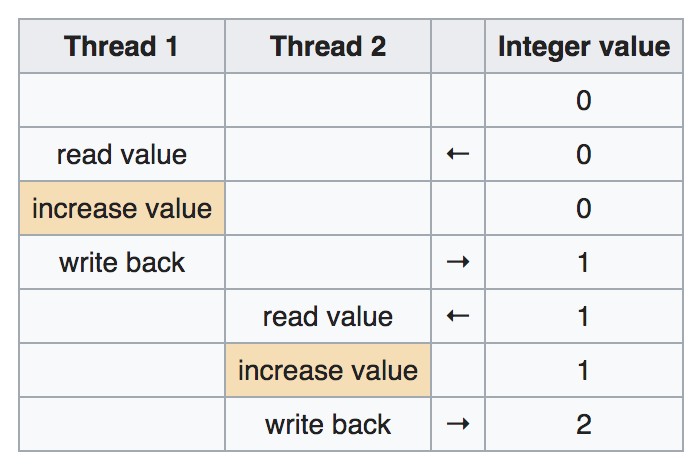
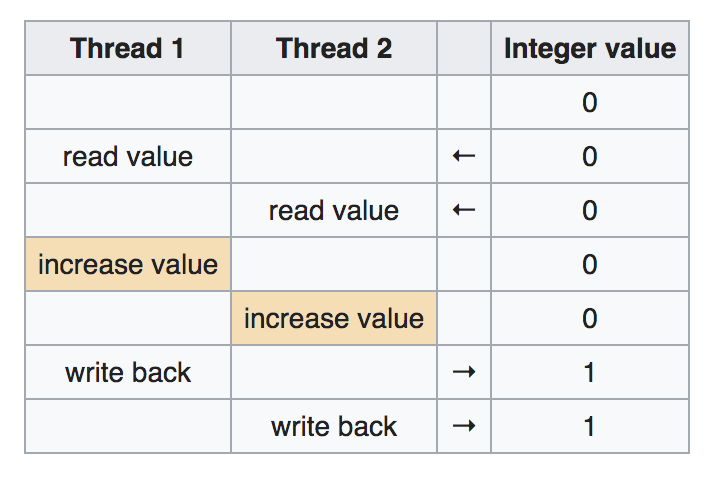
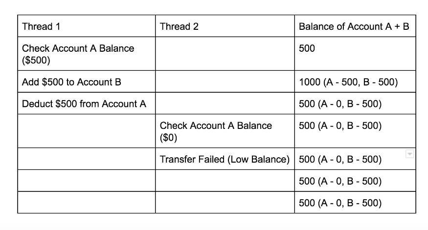
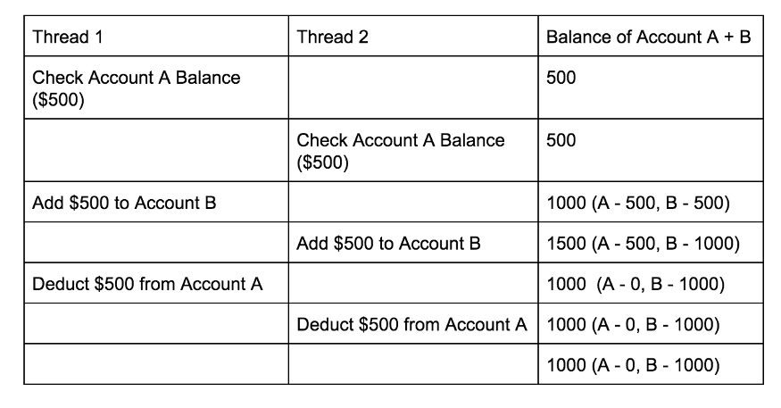

# **Java Laboratory Course**
 <strong> 1400-1401 Spring Semester </strong> 

 <strong> Dr.Matin Hashemi </strong> 

 <strong> Nima Samadi & Milad Saadat </strong> 

 <strong> Group 2 </strong> 

___
Each Lab is in a seperate folder. Here some additional explanations are provided to help you better understand the structure of the files and codes.

## LAB1:
Q1 folder is the `Hello World` program. 

Q2 folder is `getting input from stdin` program.

And finally, Q3 is `mathematical computations` program. Plus, we have done the extra part!

- If first operand is divided by zero, you will be shown "Infinity" but the program still works!

- `Prime Command` will print every single Prime number lower than the given number, regardless whether it is Prime or not.

## LAB2:
This folder contains two sub folder namely `App` and `jaba2`. The `App` folder is my (Nima Samadi) implementation of this labarotary. It contains both mandatory and extra parts of this lap. 

`jaba2` folder is Milad Saadat's implementations of the lab. It also contains extra parts of the lab along with the mandatory ones.

The codes are pretty self-explanatory and easy to understand :)

## LAB3:
All classes are in the `src` folder and executable files are in `out` folder. To test the performance of the code, we have used the following tree:

The code is figuring out if there is a path between node 0 and 3 or vice versa. 

Also we have tested the `DirectedGraph` class. The following graph has been tested:

All tests are done in `Main.java` class.

## LAB4:
Just like previous labs, all codes are in the `src` folder and executables are in the `bin` folder. `App.java` file is used to test whole system. All 10 tests are provided in this file. `FileHandler.java` class is the main class to handle interactions with file and is used to contruct the tree. 

Along with the give testcase, I tested the code with these two trees. Plus there are more tests to check if exceptions are handled correctly.

|||
|:-------:|:-------:|

Following exceptions are handled:

1. No find directive written
2. Empty find section
3. More or less than 2 elements in fine or tree section
4. Nodes in find section that don't exist in Tree section
5. Unabling to write to file or read it

## LAB5:
List:

In Java, a list interface is an ordered collection of objects in which duplicate values can be stored.
Since a List preserves the insertion order, it allows positional access and insertion of elements.
List interface is implemented by the following classes:

1. ArrayList :
	
	An ArrayList class is a resizable array, which is present in the java.util package.
	While built-in arrays have a fixed size, ArrayLists can change their size dynamically.
	Elements can be added and removed from an ArrayList whenever there is a need, helping
	the user with memory management.

2. LinkedList :

	Since a LinkedList acts as a dynamic array and we do not have to specify the size while creating it,
	the size of the list automatically increases when we dynamically add and remove items. And also,
	the elements are not stored in a continuous fashion. Therefore, there is no need to increase the size.
	Internally, the LinkedList is implemented using the doubly linked list data structure. The main difference
	between a normal linked list and a doubly LinkedList is that a doubly linked list contains an extra pointer,
	typically called the previous pointer, together with the next pointer and data which are there in the singly
	linked list.

3. Vector

4. Stack

Set: 

It is an interface that implements the mathematical set. This interface contains the methods inherited from
the Collection interface and adds a feature that restricts the insertion of the duplicate elements.
There are two interfaces that extend the set implementation namely SortedSet and NavigableSet.

Queue: 

A queue is a data structure which follows the principle of FIFO (First-In-First-Out) i.e. the elements are
inserted at the end of the list, and are deleted from the beginning of the list. This interface is available in the
java.util.package and extends the Collection Interface. Queue supports multiple methods, including insertion and
deletion. The queues available in java.util.package are known as Unbounded Queues , while the queues present in the
java.util.concurrent package are known are Bounded Queues. All queues, except the Deques, support insertion at the
end and deletion from the front. Deques support insertion and deletion of elements at both the ends.

Map:

Maps are perfect to use for key-value association mapping such as dictionaries. The maps are used to perform
lookups by keys or when someone wants to retrieve and update elements by keys. Some common scenarios are as follows:

1. A map of error codes and their descriptions.
2. A map of zip codes and cities.
3. A map of managers and employees. Each manager (key) is associated with a list of employees (value) he manages.
4. A map of classes and students. Each class (key) is associated with a list of students (value).

A Map cannot contain duplicate keys and each key can map to at most one value. Some implementations allow null key
and null values like the HashMap and LinkedHashMap, but some do not like the TreeMap. The order of a map depends on
the specific implementations. For example, TreeMap and LinkedHashMap have predictable orders, while HashMap does
not. There are two interfaces for implementing Map in java. They are Map and SortedMap, and three classes: HashMap,
TreeMap, and LinkedHashMap.

## LAB6:
Here I provide answers to questions of the race condtion section. 

Race condition happens when multiple threads tries to access a shared recourse. For examples suppose that we want to add one to a variable for some specific times. If we use two thread to achieve so, one desired and possible execution is shown in this image:

After the execution, the final value would be 2. However, programmer doesn't know how the threads would be executed (consider there is only 1 CPU core). CPU scheduling algorithm will determine which thread must be run at any time interval. With that said, you can see another possible thread execution in the following picture:

This situation is called race condition as threads are racing each other to access and change the shared resource. By using locks we can't prevent race condition. 

One possible payment vulnerability is race condition. For instance consider that you have two accounts and want to transfer money between them. In order to tansfer money, 3 things must be done:

1. Check if source account has enough balance
2. Add the money to the destination account
3. Deduct money from source account.

The correct execution of threads would be something like this:

As you can see, you can't transfer extra $500 from account A (source) to account B (destination) which makes sense. 

However, by exploiting race condition, one can gain infinite amount of money! Consider the following execution of threads:

By the time the second transfer is being done, the first one isn't comleted and account A balance hasn't been updated. So in the second transfer, it seems that you have $500 in account A. While you don't and it's being transfered to account B. That's because of the fact that deduction from account A in the first transfer hasn't been done yet. So this results in extra $500 in sum of two accounts. 

Yes. Redeeming one coupun multiple times looks like another payment vulnerability. You can use your discount multiple times by exploiting race condition. The way it happens is just like above case and I don't explain it again. 

If you run the `inc()` function 101 times, it is possible that `Failed` message gets printed. This happens when all the threads are running sequentially and there is no race condition. Because if there is a race condition, the shared variable (`count`) is updated in the same time the other thread is updating it. So, (at least) one of the +1 operations gets lost (gets overwritten). However, most of the times this doesn't happen as it is more likely that race condition happens and `count` parameter doesn't reach 100. 

The `synchroized` keyword causes `inc()` method to be run synchronously with other threads. In other words, when you use `synchroized` keyword, the execution of that function in different threads will be synchronized to each other. So, if one thread is executing `inc()` function, others cannnot call it untill the thread that is running `inc()` in first place finishes. So, this will result in eliminating race condition and all executions of `inc()` will increase `count` correctly. So, we see `Failed` message everytime we run the program. 

